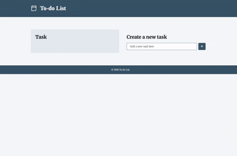

# To-do List

[🇬🇧 English](README.md) | 🇯🇵 Japanese

シンプルなToDoリスト

タスクの追加・削除・完了管理が可能。

HTML、CSS、JavaScriptを用いて開発。

## Demo
👉🏻 https://htm823.github.io/todo-list/

## Preview

## Background
JavaScriptによるデータ管理やDOM操作の基礎を学ぶために制作したTo-doリストです。

タスクの追加・表示・削除といった基本的な機能を実装することを目的としました。

日常的によく使うアプリケーションを題材にし、データの保持・加工・画面表示の流れを意識しながら実装を進めました。

## Features

### タスクの追加・表示
思いついたタスクをすぐに記録し、一覧で確認できます。

### タスクの削除（個別・一括）
不要なタスクを状況に応じて削除できます。

### 完了状態の管理
完了したタスクを視覚的に区別し、進捗を把握しやすくします。

### ローカルストレージへの保存
ブラウザを閉じてもタスクを保持できます。

## Tech Stack

### Frontend
- HTML
- CSS
- JavaScript

### Deployment
- GitHub Pages

## Technology Choices
JavaScriptによるデータ管理やDOM操作の基礎を理解することを目的としたため、フレームワークは使用せず、HTML・CSS・JavaScriptのみで実装しました。

## System Design
シンプルで直感的に操作できるUIを目指しました。

操作ボタンにはアクセントカラーを使用し、クリックできる要素であることが視覚的に伝わるようにしています。

また、削除ボタンには赤色を使用し、注意が必要な操作であることを区別できるデザインにしました。

## Implementation Highlights
タスクの追加・削除・完了状態の変更は、`tasks`配列を唯一のデータソースとして管理するよう実装しました。

データを更新した後に画面を再描画する構成とすることで、データとUIの整合性を保てるようにしています。

また、タスクの追加はフォームの`submit`イベントを利用し、

追加ボタンのクリックとEnterキーの両方で操作できるようにしました。

## Challenges & Solutions
当初は追加ボタンに`click`イベントを設定していましたが、キーボード操作にも対応する必要があると考えました。

そのため、フォームの`submit`イベントを利用する実装へ変更しました。

変更にあたり、ボタンを`form`要素内に配置し、`type="submit"`を指定することで、ボタンのクリックとEnterキーのどちらでも同じ処理が実行されるようにしました。

フォームイベントの仕組みと、同一の処理を一か所にまとめて管理する実装方法を学びました。

## Future Improvements
今後は、アクセシビリティの向上を目的として、ボタン要素をはじめとするUIの実装を見直し、リファクタリングに取り組みたいと考えています。

また、実際の利用シーンやターゲットユーザーを明確にしたうえで、必要な機能を検討し、より実用性の高いアプリケーションへ発展させていきたいです。

## License & Usage
このリポジトリは、ポートフォリオとして公開しています。

ソースコードはオープンソースではなく、開発内容や技術力を紹介する目的で公開しています。

## Explore More Projects
GitHubプロフィールでは、他のプロジェクトも公開しています。

👉🏻 https://github.com/htm823